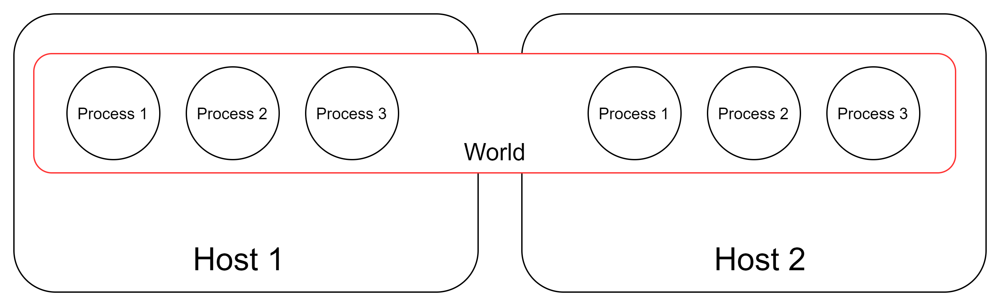
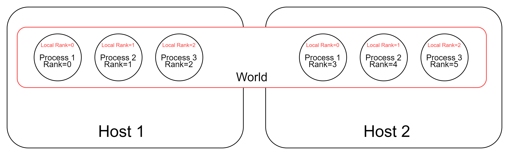

# PyTorch分布式训练

## 1. 进程通信概念  

### 1.1 主机，进程  

每个主机可以运行多个进程，通常各个进程都是在做各自的事情，进程之间互不相干。

在**[MPI](https://mpitutorial.com/tutorials/mpi-introduction/zh_cn/)**（消息传递接口（MPI）。MPI 几乎是所有分布式计算的主力。MPI 是一个开放标准，它定义了一系列关于节点互相通信的规则，MPI 也是一个编程模型/API。MPI 不是一款软件或者工具，它是一种规范）中，我们可以拥有一组可以互发消息的进程，这些进程甚至可以跨主机进行通信，这是我们称主机为节点，进程为工作节点，但在PyTorch中，还是采用主机和进程的说法。

### 1.2 World，Rank

**world**可以认为是所有进程的集合。如下图中Host1中Host2中所有的进程集合被称为一个world，world size代表的就是这组能够通信的进程总数，图中world size=6。




**rank** 可以认为是这组能够通信的进程在world中的序号


**Local Rank** 可以认为是可以互相通信的进程在自己主机上的序号，注意每个主机中local rank的编号都是从零开始的



## 2. PyTorch单机多卡数据并行

### 2.1 启动多进程

```python
#run_multiprocess.py
#运行命令：python run_multiprocess.py
import torch.multiprocessing as mp #这是一个多进程的包
 
def run(rank, size):
    print("world size:{}. I'm rank {}.".format(size,rank))
 
 
if __name__ == "__main__":
    world_size = 4
    #设置多进程的启动方式为spawn，使用此方式启动的进程,只会执行和 target 参数或者 run() 方法相关的代码。
    mp.set_start_method("spawn") 
    #创建进程对象
    #target为该进程要运行的函数，args为target函数的输入参数
    p0 = mp.Process(target=run, args=(0, world_size))
    p1 = mp.Process(target=run, args=(1, world_size))
    p2 = mp.Process(target=run, args=(2, world_size))
    p3 = mp.Process(target=run, args=(3, world_size))
 
    #启动进程
    p0.start()
    p1.start()
    p2.start()
    p3.start()
 
    #当前进程会阻塞在join函数，直到相应进程结束。
    p0.join() #主线程等待p终止，p.join只能join住start开启的进程,而不能join住run开启的进程
    p1.join()
    p2.join()
    p3.join()
```


### 2.2 多进程间通信

```python
#multiprocess_comm.py
#运行命令：python multiprocess_comm.py
 
import os
import torch.distributed as dist #PyTorch 分布式训练包
import torch.multiprocessing as mp
 
def run(rank, size):
    #MASTER_ADDR和MASTER_PORT是通信模块初始化需要的两个环境变量。
    #由于是在单机上，所以用localhost的ip就可以了。
    os.environ['MASTER_ADDR'] = '127.0.0.1'
    #端口可以是任意空闲端口
    os.environ['MASTER_PORT'] = '29500'
    #通信模块初始化
    #进程会阻塞在该函数，直到确定所有进程都可以通信。
    dist.init_process_group('gloo', rank=rank, world_size=size)#初始化分布式环境，第一个参数指定的是通信后端
    print("world size:{}. I'm rank {}.".format(size,rank))
 
 
if __name__ == "__main__":
    #world size的数量要与开启的进程数量相等，否则会出错
    world_size = 4
    mp.set_start_method("spawn")
    #创建进程对象
    #target为该进程要运行的函数，args为函数的输入参数
    p0 = mp.Process(target=run, args=(0, world_size))
    p1 = mp.Process(target=run, args=(1, world_size))
    p2 = mp.Process(target=run, args=(2, world_size))
    p3 = mp.Process(target=run, args=(3, world_size))
 
    #启动进程
    p0.start()
    p1.start()
    p2.start()
    p3.start()
 
    #等待进程结束
    p0.join()
    p1.join()
    p2.join()
    p3.join()
```


## 参考资料

[PyTorch单机多卡分布式训练教程及代码示例](https://blog.csdn.net/zzxxxaa1/article/details/121421075)
