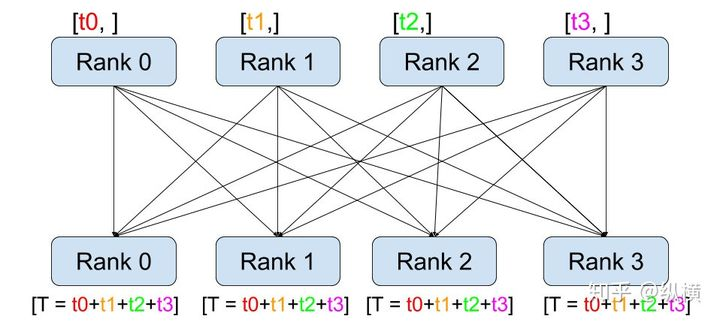

# 分布式通信包 - torch.distributed

## 1. 支持的后端

`torch.distributed` 支持三个后端，每个后端具有不同的功能。下表显示哪些功能可用于CPU/CUDA张量。仅当用于构建PyTorch的实现支持时，MPI才支持CUDA。目前PyTorch分发版仅支持Linux。默认情况下，Gloo和NCCL后端构建并包含在PyTorch的分布之中（仅在使用CUDA构建时为NCCL）。MPI是一个可选的后端，只有从源代码构建PyTorch时才能包含它。（例如，在安装了MPI的主机上构建PyTorch）

| Backend        | `gloo` | `gloo` | `mpi` | `mpi` | `nccl` | `nccl` |
| :------------- | :----- | :---: | :----: | :--: | :--: | :--: |
| Device         | CPU    | GPU   | CPU    | GPU  | CPU  | GPU  |
| send           | ✓      | ✘     | ✓      | ?    | ✘    |  ✓   |
| recv           | ✓      | ✘     | ✓      | ?    | ✘    |  ✓   |
| broadcast      | ✓      | ✓     | ✓      | ?    | ✘    |  ✓   |
| all_reduce     | ✓      | ✓     | ✓      | ?    | ✘    |  ✓   |
| reduce         | ✓      | ✘     | ✓      | ?    | ✘    |  ✓   |
| all_gather     | ✓      | ✘     | ✓      | ?    | ✘    |  ✓   |
| gather         | ✓      | ✘     | ✓      | ?    | ✘    |  ✓   |
| scatter        | ✓      | ✘     | ✓      | ?    | ✘    |  ✘   |
| reduce_scatter | ✘      | ✘     | ✘      | ✘    | ✘    |  ✓   |
| all_to_all     | ✘      | ✘     | ✓      | ?    | ✘    |  ✓   |
| barrier        | ✓      | ✘     | ✓      | ?    | ✘    |  ✓   |


## 2. 支持的分布式环境初始化方式

### 2.1 TCP初始化

有两种方法可以使用TCP进行初始化，这两种方法都需要从所有进程可以访问的网络地址和所需的`world_size`。第一种方法需要指定属于rank 0进程的地址。此初始化方法要求所有进程都具有手动指定的排名。

> [!NOTE|style:flat]
> 请注意，最新的分布式软件包中不再支持多播地址。`group_name`也被弃用了。

```python
import torch.distributed as dist
# 使用其中一台机器的地址
dist.init_process_group(backend, init_method='tcp://10.1.1.20:23456',rank=args.rank, world_size=4)
```

### 2.2 共享文件系统初始化

另一种初始化方法使用一个文件系统，该文件系统与组中的所有机器共享和可见，以及所需的`world_size`。URL应以`file：//`开头，并包含共享文件系统上不存在的文件（在现有目录中）的路径。如果文件不存在，文件系统初始化将自动创建该文件，但不会删除该文件。因此，下一步初始化 [`init_process_group()`](https://links.jianshu.com/go?to=https%3A%2F%2Fgithub.com%2Fapachecn%2Fpytorch-doc-zh%2Fblob%2Fmaster%2Fdocs%2F1.0%2Fdistributed.md%23torch.distributed.init_process_group) 在相同的文件路径发生之前您有责任确保清理文件。

> [!NOTE|style:flat]
> 请注意，在最新的分布式软件包中不再支持自动排名分配，并且也不推荐使用`group_name`。

警告

> [!Warning|style:flat]
> 此方法假定文件系统支持使用`fcntl`进行锁定 - 大多数本地系统和NFS都支持它。  

此方法将始终创建该文件，并尽力在程序结束时清理并删除该文件。换句话说，每次进行初始化都需要创建一个全新的空文件，以便初始化成功。如果再次使用先前初始化使用的相同文件（不会被清除），则这是意外行为，并且经常会导致死锁和故障。因此，即使此方法将尽力清理文件，如果自动删除不成功，您有责任确保在训练结束时删除该文件以防止同一文件被删除 下次再次使用。如果你打算在相同的文件系统路径下多次调用 [`init_process_group()`](https://links.jianshu.com/go?to=https%3A%2F%2Fgithub.com%2Fapachecn%2Fpytorch-doc-zh%2Fblob%2Fmaster%2Fdocs%2F1.0%2Fdistributed.md%23torch.distributed.init_process_group) 的时候，就显得尤为重要了。换一种说法，如果那个文件没有被移除并且你再次调用 [`init_process_group()`](https://links.jianshu.com/go?to=https%3A%2F%2Fgithub.com%2Fapachecn%2Fpytorch-doc-zh%2Fblob%2Fmaster%2Fdocs%2F1.0%2Fdistributed.md%23torch.distributed.init_process_group)，那么失败是可想而知的。这里的经验法则是，每当调用[`init_process_group()`](https://links.jianshu.com/go?to=https%3A%2F%2Fgithub.com%2Fapachecn%2Fpytorch-doc-zh%2Fblob%2Fmaster%2Fdocs%2F1.0%2Fdistributed.md%23torch.distributed.init_process_group)的时候，确保文件不存在或为空。

```python
import torch.distributed as dist
# 应始终指定等级
dist.init_process_group(backend, init_method='file:///mnt/nfs/sharedfile',world_size=4, rank=args.rank)
```

### 2.4 环境变量初始化

此方法将从环境变量中读取配置，从而可以完全自定义信息的获取方式。要设置的变量是：

MASTER_PORT - 需要; 必须是机器上的自由端口，等级为0。
 MASTER_ADDR - 要求（0级除外）; 等级0节点的地址。
 WORLD_SIZE - 需要; 可以在这里设置，也可以在调用init函数时设置。
 RANK - 需要; 可以在这里设置，也可以在调用init函数时设置。
 等级为0的机器将用于设置所有连接。

这是默认方法，意味着不必指定init_method（或者可以是env：//）。


## 3. torch.distributed.all_reduce工作过程

**汇总记录不同 GPU 上生成的准确率、损失函数等指标信息**。这个 API 就是 `torch.distributed.all_reduce`。示意图如下：



具体来说，它的工作过程包含以下三步：

1. 通过调用 `all_reduce(tensor, op=...)`，当前进程会向其他进程发送 `tensor`（例如 rank 0 会发送 rank 0 的 tensor 到 rank 1、2、3）
2. 接受其他进程发来的 `tensor`（例如 rank 0 会接收 rank 1 的 tensor、rank 2 的 tensor、rank 3 的 tensor）。
3. 在全部接收完成后，当前进程（例如rank 0）会对当前进程的和接收到的 `tensor` （例如 rank 0 的 tensor、rank 1 的 tensor、rank 2 的 tensor、rank 3 的 tensor）进行 `op` （例如求和）操作。

使用 `torch.distributed.all_reduce(loss, op=torch.distributed.reduce_op.SUM)`，我们就能够对不数据切片（不同 GPU 上的训练数据）的损失函数进行求和了。接着，我们只要再将其除以进程（GPU）数量 `world_size`就可以得到损失函数的平均值。

## 4. torch.distributed.reduce()工作过程

`dist.reduce(tensor, dst, op, group)`：将 `op` 应用于每个 `tensor` 并将结果存储在 dst 中


## 参考资料

[NCCL、OpenMPI、Gloo对比](https://blog.csdn.net/taoqick/article/details/126449935)

[torch.distributed.all_reduce的架构介绍](https://github.com/tczhangzhi/pytorch-distributed)

[分布式通信包 - torch.distributed](https://www.jianshu.com/p/5f6cd6b50140)

[PyTorch torch.distributed官方文档](https://pytorch.org/docs/stable/distributed.html)

[PyTorch 多GPU训练实践 (4) - DDP 进阶](https://zhuanlan.zhihu.com/p/543207172)