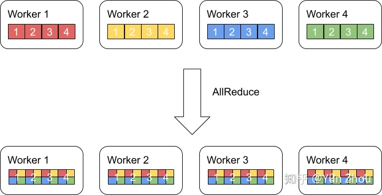
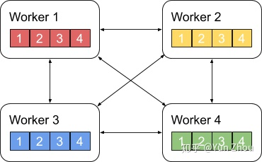
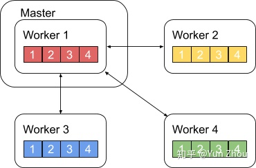
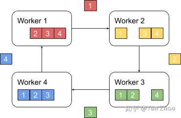
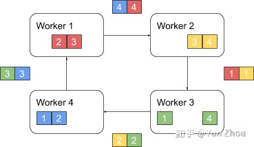
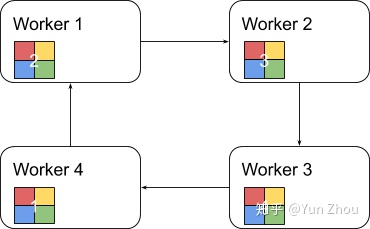

# 分布式架构

## 1. AllReduce

AllReduce其实是一类算法，目标是高效得将不同机器中的数据整合（reduce）之后再把结果分发给各个机器。在深度学习应用中，数据往往是一个向量或者矩阵，通常用的整合则有Sum、Max、Min等。图一展示了AllReduce在有四台机器，每台机器有一个长度为四的向量时的输入和输出。

AllReduce具体实现的方法有很多种，最单纯的实现方式就是每个worker将自己的数据发给其他的所有worker，然而这种方式存在大量的浪费

## 2. 主从式架构

一个略优的实现是利用主从式架构，将一个worker设为master，其余所有worker把数据发送给master之后，由master进行整合元算，完成之后再分发给其余worker。不过这种实现master往往会成为整个网络的瓶颈。

## 3. Ring All Reduce

Ring AllReduce算法分为两个阶段。

第一阶段，将N个worker分布在一个环上，并且把每个worker的数据分成N份。

接下来我们具体看第k个worker，这个worker会把第k份数据发给下一个worker，同时从前一个worker收到第k-1份数据。

之后worker会把收到的第k-1份数据和自己的第k-1份数据整合，再将整合的数据发送给下一个worker。

以此循环N次之后，每一个worker都会包含最终整合结果的一份。

第二阶段，每个worker将整合好的部分发送给下一个worker。worker在收到数据之后更新自身数据对应的部分即可。

假设每个worker的数据是一个长度为S的向量，那么个Ring AllReduce里，每个worker发送的数据量是O(S)，和worker的数量N无关。这样就避免了主从架构中master需要处理O(S*N)的数据量而成为网络瓶颈的问题。

## 4. Map/Reduce 架构

主要是基于 hadoop 的mahout 和基于spark 的MLLib

## 5. Parameter Server 架构

参数服务器是一种广泛使用的通用的分布式机器学习架构，无论是 google 的上一代机器学习框架 distbelief 和最新的机器学习框架 tensorflow，百度的 paddle，亚马逊的 mxnet，还是 facebook 的 pytorch 在分布式训练上都提供了 Parameter Server支持

## 链接

[【论文精读】基于参数服务器的可扩展分布式机器学习](https://zhuanlan.zhihu.com/p/508056568)