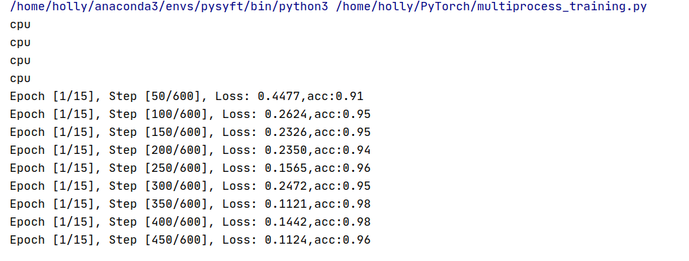
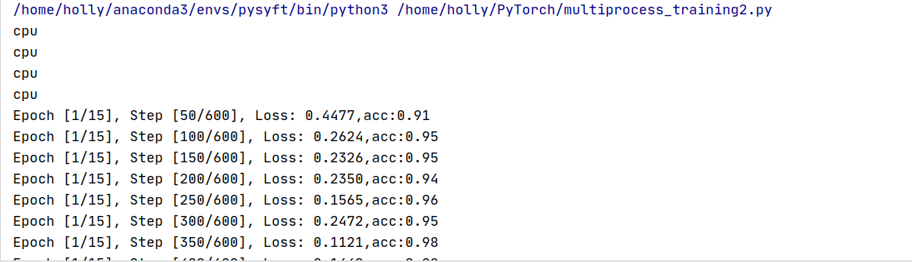

# 单机分布式训练MNIST(CPU)

## 1. All_Reduce

使用使用`torch.distributed.all_reduce()`

#### 代码示例

```python
# multiprocess_training.py
# 运行命令：python multiprocess_training.py
import os
import torch
import torch.distributed as dist
import torch.multiprocessing as mp
import torch.nn as nn
import torchvision
import torchvision.transforms as transforms


# 用于平均梯度的函数
def average_gradients(model):
    size = float(dist.get_world_size())
    for param in model.parameters():
        dist.all_reduce(param.grad.data, op=dist.ReduceOp.SUM)
        param.grad.data /= size


# 模型
class ConvNet(nn.Module):
    def __init__(self, num_classes=10):
        super(ConvNet, self).__init__()
        self.layer1 = nn.Sequential(
            nn.Conv2d(1, 16, kernel_size=5, stride=1, padding=2),
            nn.BatchNorm2d(16),
            nn.ReLU(),
            nn.MaxPool2d(kernel_size=2, stride=2))
        self.layer2 = nn.Sequential(
            nn.Conv2d(16, 32, kernel_size=5, stride=1, padding=2),
            nn.BatchNorm2d(32),
            nn.ReLU(),
            nn.MaxPool2d(kernel_size=2, stride=2))
        self.fc = nn.Linear(7 * 7 * 32, num_classes)

    def forward(self, x):
        out = self.layer1(x)
        out = self.layer2(out)
        out = out.reshape(out.size(0), -1)
        out = self.fc(out)
        return out


def accuracy(outputs, labels):
    _, preds = torch.max(outputs, 1)  # taking the highest value of prediction.
    correct_number = torch.sum(preds == labels.data)
    return (correct_number / len(preds)).item()


def run(rank, size):
    # MASTER_ADDR和MASTER_PORT是通信模块初始化需要的两个环境变量。
    # 由于是在单机上，所以用localhost的ip就可以了。
    os.environ['MASTER_ADDR'] = '127.0.0.1'
    # 端口可以是任意空闲端口
    os.environ['MASTER_PORT'] = '29500'
    dist.init_process_group('gloo', rank=rank, world_size=size)

    # 1.数据集预处理
    train_dataset = torchvision.datasets.MNIST(root='../data',
                                               train=True,
                                               transform=transforms.ToTensor(),
                                               download=True)
    training_loader = torch.utils.data.DataLoader(train_dataset, batch_size=100, shuffle=True)

    # 2.搭建模型
    # device = torch.device("cuda:{}".format(rank))
    device = torch.device("cpu")
    print(device)
    torch.manual_seed(0)
    model = ConvNet().to(device)
    torch.manual_seed(rank)
    criterion = nn.CrossEntropyLoss()
    optimizer = torch.optim.SGD(model.parameters(), lr=0.001, momentum=0.9)  # fine tuned the lr
    # 3.开始训练
    epochs = 15
    batch_num = len(training_loader)
    running_loss_history = []
    for e in range(epochs):
        for i, (inputs, labels) in enumerate(training_loader):
            inputs = inputs.to(device)
            labels = labels.to(device)
            # 前向传播
            outputs = model(inputs)
            loss = criterion(outputs, labels)
            optimizer.zero_grad()
            # 反传
            loss.backward()
            # 记录loss
            running_loss_history.append(loss.item())
            # 参数更新前需要Allreduce梯度。
            average_gradients(model)
            # 参数更新
            optimizer.step()
            if (i + 1) % 50 == 0 and rank == 0:
                print('Epoch [{}/{}], Step [{}/{}], Loss: {:.4f},acc:{:.2f}'.format(e + 1, epochs, i + 1, batch_num,
                                                                                    loss.item(),
                                                                                    accuracy(outputs, labels)))


if __name__ == "__main__":
    world_size = 4
    mp.set_start_method("spawn")
    # 创建进程对象
    # target为该进程要运行的函数，args为target函数的输入参数
    p0 = mp.Process(target=run, args=(0, world_size))
    p1 = mp.Process(target=run, args=(1, world_size))
    p2 = mp.Process(target=run, args=(2, world_size))
    p3 = mp.Process(target=run, args=(3, world_size))

    # 启动进程
    p0.start()
    p1.start()
    p2.start()
    p3.start()

    # 当前进程会阻塞在join函数，直到相应进程结束。
    p0.join()
    p1.join()
    p2.join()
    p3.join()
```

#### 训练效果



## 2 . 主从式架构

使用`torch.distributed.reduce()`

#### 代码示例

```python
# multiprocess_training.py
# 运行命令：python multiprocess_training.py
import os
import torch
import torch.distributed as dist
import torch.multiprocessing as mp
import torch.nn as nn
import torchvision
import torchvision.transforms as transforms


# torch.distributed.reduce
def average_gradients(model):
    size = float(dist.get_world_size())
    for param in model.parameters():
        dist.reduce(param.grad.data,0, op=dist.ReduceOp.SUM)
        if(dist.get_rank()==0):
            param.grad.data/=size
        dist.broadcast(param.grad.data,src=0)

# 模型
class ConvNet(nn.Module):
    def __init__(self, num_classes=10):
        super(ConvNet, self).__init__()
        self.layer1 = nn.Sequential(
            nn.Conv2d(1, 16, kernel_size=5, stride=1, padding=2),
            nn.BatchNorm2d(16),
            nn.ReLU(),
            nn.MaxPool2d(kernel_size=2, stride=2))
        self.layer2 = nn.Sequential(
            nn.Conv2d(16, 32, kernel_size=5, stride=1, padding=2),
            nn.BatchNorm2d(32),
            nn.ReLU(),
            nn.MaxPool2d(kernel_size=2, stride=2))
        self.fc = nn.Linear(7 * 7 * 32, num_classes)

    def forward(self, x):
        out = self.layer1(x)
        out = self.layer2(out)
        out = out.reshape(out.size(0), -1)
        out = self.fc(out)
        return out


def accuracy(outputs, labels):
    _, preds = torch.max(outputs, 1)  # taking the highest value of prediction.
    correct_number = torch.sum(preds == labels.data)
    return (correct_number / len(preds)).item()


def run(rank, size):
    # MASTER_ADDR和MASTER_PORT是通信模块初始化需要的两个环境变量。
    # 由于是在单机上，所以用localhost的ip就可以了。
    os.environ['MASTER_ADDR'] = '127.0.0.1'
    # 端口可以是任意空闲端口
    os.environ['MASTER_PORT'] = '29500'
    dist.init_process_group('gloo', rank=rank, world_size=size)

    # 1.数据集预处理
    train_dataset = torchvision.datasets.MNIST(root='../data',
                                               train=True,
                                               transform=transforms.ToTensor(),
                                               download=True)
    training_loader = torch.utils.data.DataLoader(train_dataset, batch_size=100, shuffle=True)

    # 2.搭建模型
    # device = torch.device("cuda:{}".format(rank))
    device = torch.device("cpu")
    print(device)
    torch.manual_seed(0)
    model = ConvNet().to(device)
    torch.manual_seed(rank)
    criterion = nn.CrossEntropyLoss()
    optimizer = torch.optim.SGD(model.parameters(), lr=0.001, momentum=0.9)  # fine tuned the lr
    # 3.开始训练
    epochs = 15
    batch_num = len(training_loader)
    running_loss_history = []
    for e in range(epochs):
        for i, (inputs, labels) in enumerate(training_loader):
            inputs = inputs.to(device)
            labels = labels.to(device)
            # 前向传播
            outputs = model(inputs)
            loss = criterion(outputs, labels)
            optimizer.zero_grad()
            # 反传
            loss.backward()
            # 记录loss
            running_loss_history.append(loss.item())
            # 参数更新前需要Allreduce梯度。
            average_gradients(model)
            # 参数更新
            optimizer.step()
            if (i + 1) % 50 == 0 and rank == 0:
                print('Epoch [{}/{}], Step [{}/{}], Loss: {:.4f},acc:{:.2f}'.format(e + 1, epochs, i + 1, batch_num,
                                                                                    loss.item(),
                                                                                    accuracy(outputs, labels)))


if __name__ == "__main__":
    world_size = 4
    mp.set_start_method("spawn")
    # 创建进程对象
    # target为该进程要运行的函数，args为target函数的输入参数
    p0 = mp.Process(target=run, args=(0, world_size))
    p1 = mp.Process(target=run, args=(1, world_size))
    p2 = mp.Process(target=run, args=(2, world_size))
    p3 = mp.Process(target=run, args=(3, world_size))

    # 启动进程
    p0.start()
    p1.start()
    p2.start()
    p3.start()

    # 当前进程会阻塞在join函数，直到相应进程结束。
    p0.join()
    p1.join()
    p2.join()
    p3.join()
```

#### 训练效果


