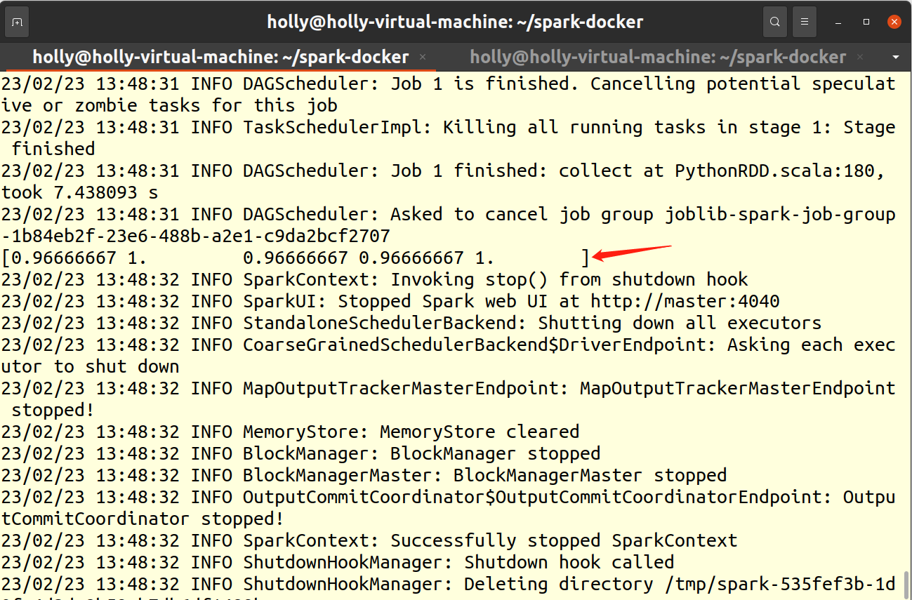

# Joblib Apache Spark Backend

## 一、介绍

这个库为` joblib` 提供了 `ApacheSpark` 后端，以便在` Spark` 集群上分发任务。

[Joblib](https://link.zhihu.com/?target=https%3A//link.juejin.im/%3Ftarget%3Dhttps%3A%2F%2Fjoblib.readthedocs.io%2Fen%2Flatest%2F)是一个可以简单地将Python代码转换为并行计算模式的软件包，它可非常简单并行我们的程序，从而提高计算速度。

[Joblib](https://link.zhihu.com/?target=https%3A//link.juejin.im/%3Ftarget%3Dhttps%3A%2F%2Fjoblib.readthedocs.io%2Fen%2Flatest%2F)是一组用于在Python中提供轻量级流水线的工具。 它具有以下功能：

- 透明的磁盘缓存功能和“懒惰”执行模式，简单的并行计算
- Joblib对`numpy`大型数组进行了特定的优化，简单，快速。

``Scikit-learn`使用[joblib](https://joblib.readthedocs.io/en/latest/)库在其估计器中支持并行计算。有关控制并行计算的开关，请参阅joblib文档。

## 二、安装

`joblibspark` requires Python 3.6+, `joblib>=0.14` and `pyspark>=2.4` to run. To install `joblibspark`, run:

```
pip install joblibspark
```

The installation does not install PySpark because for most users, PySpark is already installed. If you do not have PySpark installed, you can install `pyspark` together with `joblibspark`:

```
pip install pyspark>=3.0.0 joblibspark
```

If you want to use `joblibspark` with `scikit-learn`, please install `scikit-learn>=0.21`.

```
pip install scikit-learn
```

## 三、示例

```python
from sklearn.utils import parallel_backend
from sklearn.model_selection import cross_val_score
from sklearn import datasets
from sklearn import svm
from joblibspark import register_spark

register_spark() # register spark backend

iris = datasets.load_iris()
clf = svm.SVC(kernel='linear', C=1)
with parallel_backend('spark', n_jobs=3):
  scores = cross_val_score(clf, iris.data, iris.target, cv=5)

print(scores)
```

执行命令，将程序提交到集群

```bash
spark-submit --master spark://master:7077 /opt/share/sklearn-svm.py
```

运行效果



## 四、局限性

`joblibspark` does not generally support run model inference and feature engineering in parallel. For example:

```
from sklearn.feature_extraction import FeatureHasher
h = FeatureHasher(n_features=10)
with parallel_backend('spark', n_jobs=3):
    # This won't run parallelly on spark, it will still run locally.
    h.transform(...)

from sklearn import linear_model
regr = linear_model.LinearRegression()
regr.fit(X_train, y_train)

with parallel_backend('spark', n_jobs=3):
    # This won't run parallelly on spark, it will still run locally.
    regr.predict(diabetes_X_test)
```

Note: for `sklearn.ensemble.RandomForestClassifier`, there is a `n_jobs` parameter, that means the algorithm support model training/inference in parallel, but in its inference implementation, it bind the backend to built-in backends, so the spark backend not work for this case.